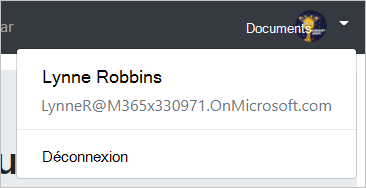

<!-- markdownlint-disable MD002 MD041 -->

<span data-ttu-id="498ff-101">Dans cet exercice, vous allez étendre l’application de l’exercice précédent pour prendre en charge l’authentification avec Azure AD.</span><span class="sxs-lookup"><span data-stu-id="498ff-101">In this exercise you will extend the application from the previous exercise to support authentication with Azure AD.</span></span> <span data-ttu-id="498ff-102">Cela est nécessaire pour obtenir le jeton d’accès OAuth nécessaire pour appeler Microsoft Graph.</span><span class="sxs-lookup"><span data-stu-id="498ff-102">This is required to obtain the necessary OAuth access token to call the Microsoft Graph.</span></span> <span data-ttu-id="498ff-103">Dans cette étape, vous allez intégrer la [bibliothèque d’authentification Microsoft pour les angles](https://github.com/AzureAD/microsoft-authentication-library-for-js/blob/dev/lib/msal-angular/README.md) dans l’application.</span><span class="sxs-lookup"><span data-stu-id="498ff-103">In this step you will integrate the [Microsoft Authentication Library for Angular](https://github.com/AzureAD/microsoft-authentication-library-for-js/blob/dev/lib/msal-angular/README.md) into the application.</span></span>

<span data-ttu-id="498ff-104">Créez un fichier dans le `./src` répertoire nommé `oauth.ts` et ajoutez le code suivant.</span><span class="sxs-lookup"><span data-stu-id="498ff-104">Create a new file in the `./src` directory named `oauth.ts` and add the following code.</span></span>

```TypeScript
export const OAuthSettings = {
  appId: 'YOUR_APP_ID_HERE',
  scopes: [
    "user.read",
    "calendars.read"
  ]
};
```

<span data-ttu-id="498ff-105">Remplacez `YOUR_APP_ID_HERE` par l’ID de l’application dans le portail d’inscription des applications.</span><span class="sxs-lookup"><span data-stu-id="498ff-105">Replace `YOUR_APP_ID_HERE` with the application ID from the Application Registration Portal.</span></span>

> [!IMPORTANT]
> <span data-ttu-id="498ff-106">Si vous utilisez le contrôle de code source tel que git, il est maintenant recommandé d’exclure le `oauth.ts` fichier du contrôle de code source afin d’éviter une fuite accidentelle de votre ID d’application.</span><span class="sxs-lookup"><span data-stu-id="498ff-106">If you're using source control such as git, now would be a good time to exclude the `oauth.ts` file from source control to avoid inadvertently leaking your app ID.</span></span>

<span data-ttu-id="498ff-107">Ouvrez `./src/app/app.module.ts` et ajoutez les instructions `import` suivantes en haut du fichier.</span><span class="sxs-lookup"><span data-stu-id="498ff-107">Open `./src/app/app.module.ts` and add the following `import` statements to the top of the file.</span></span>

```TypeScript
import { MsalModule } from '@azure/msal-angular';
import { OAuthSettings } from '../oauth';
```

<span data-ttu-id="498ff-108">Ajoutez ensuite le `MsalModule` au `imports` tableau à l’intérieur `@NgModule` de la déclaration et INITIALISEz-le avec l’ID de l’application.</span><span class="sxs-lookup"><span data-stu-id="498ff-108">Then add the `MsalModule` to the `imports` array inside the `@NgModule` declaration, and initialize it with the app ID.</span></span>

```TypeScript
imports: [
  BrowserModule,
  AppRoutingModule,
  NgbModule,
  FontAwesomeModule,
  MsalModule.forRoot({
    clientID: OAuthSettings.appId
  })
],
```

## <a name="implement-sign-in"></a><span data-ttu-id="498ff-109">Mettre en œuvre la connexion</span><span class="sxs-lookup"><span data-stu-id="498ff-109">Implement sign-in</span></span>

<span data-ttu-id="498ff-110">Commencez par définir une classe `User` simple pour conserver les informations sur l’utilisateur que l’application affiche.</span><span class="sxs-lookup"><span data-stu-id="498ff-110">Start by defining a simple `User` class to hold the information about the user that the app displays.</span></span> <span data-ttu-id="498ff-111">Créez un fichier dans le `./src/app` dossier nommé `user.ts` et ajoutez le code suivant.</span><span class="sxs-lookup"><span data-stu-id="498ff-111">Create a new file in the `./src/app` folder named `user.ts` and add the following code.</span></span>

```TypeScript
export class User {
  displayName: string;
  email: string;
  avatar: string;
}
```

<span data-ttu-id="498ff-112">Créez maintenant un service d’authentification.</span><span class="sxs-lookup"><span data-stu-id="498ff-112">Now create an authentication service.</span></span> <span data-ttu-id="498ff-113">En créant un service pour cela, vous pouvez facilement l’injecter dans les composants qui ont besoin d’accéder aux méthodes d’authentification.</span><span class="sxs-lookup"><span data-stu-id="498ff-113">By creating a service for this, you can easily inject it into any components that need access to authentication methods.</span></span> <span data-ttu-id="498ff-114">Exécutez la commande suivante dans votre interface CLI.</span><span class="sxs-lookup"><span data-stu-id="498ff-114">Run the following command in your CLI.</span></span>

```Shell
ng generate service auth
```

<span data-ttu-id="498ff-115">Une fois la commande terminée, ouvrez `./src/app/auth.service.ts` le fichier et remplacez son contenu par le code suivant.</span><span class="sxs-lookup"><span data-stu-id="498ff-115">Once the command finishes, open the `./src/app/auth.service.ts` file and replace its contents with the following code.</span></span>

```TypeScript
import { Injectable } from '@angular/core';
import { MsalService } from '@azure/msal-angular';

import { AlertsService } from './alerts.service';
import { OAuthSettings } from '../oauth';
import { User } from './user';

@Injectable({
  providedIn: 'root'
})
export class AuthService {
  public authenticated: boolean;
  public user: User;

  constructor(
    private msalService: MsalService,
    private alertsService: AlertsService) {

    this.authenticated = false;
    this.user = null;
  }

  // Prompt the user to sign in and
  // grant consent to the requested permission scopes
  async signIn(): Promise<void> {
    let result = await this.msalService.loginPopup(OAuthSettings.scopes)
      .catch((reason) => {
        this.alertsService.add('Login failed', JSON.stringify(reason, null, 2));
      });

    if (result) {
      this.authenticated = true;
      // Temporary placeholder
      this.user = new User();
      this.user.displayName = "Adele Vance";
      this.user.email = "AdeleV@contoso.com";
    }
  }

  // Sign out
  signOut(): void {
    this.msalService.logout();
    this.user = null;
    this.authenticated = false;
  }

  // Silently request an access token
  async getAccessToken(): Promise<string> {
    let result = await this.msalService.acquireTokenSilent(OAuthSettings.scopes)
      .catch((reason) => {
        this.alertsService.add('Get token failed', JSON.stringify(reason, null, 2));
      });

    // Temporary to display token in an error box
    if (result) this.alertsService.add('Token acquired', result);
    return result;
  }
}
```

<span data-ttu-id="498ff-116">Maintenant que vous disposez du service d’authentification, il peut être injecté dans les composants qui se connectent.</span><span class="sxs-lookup"><span data-stu-id="498ff-116">Now that you have the authentication service, it can be injected into the components that do sign-in.</span></span> <span data-ttu-id="498ff-117">Commencez par le `NavBarComponent`.</span><span class="sxs-lookup"><span data-stu-id="498ff-117">Start with the `NavBarComponent`.</span></span> <span data-ttu-id="498ff-118">Ouvrez le `./src/app/nav-bar/nav-bar.component.ts` fichier et effectuez les modifications suivantes.</span><span class="sxs-lookup"><span data-stu-id="498ff-118">Open the `./src/app/nav-bar/nav-bar.component.ts` file and make the following changes.</span></span>

- <span data-ttu-id="498ff-119">Ajouter `import { AuthService } from '../auth.service';` en haut du fichier.</span><span class="sxs-lookup"><span data-stu-id="498ff-119">Add `import { AuthService } from '../auth.service';` to the top of the file.</span></span>
- <span data-ttu-id="498ff-120">Supprimez `authenticated` les `user` propriétés et de la classe, puis supprimez le code qui les `ngOnInit`définit.</span><span class="sxs-lookup"><span data-stu-id="498ff-120">Remove the `authenticated` and `user` properties from the class, and remove the code that sets them in `ngOnInit`.</span></span>
- <span data-ttu-id="498ff-121">Injectez `AuthService` le en ajoutant le paramètre suivant à `constructor`: `private authService: AuthService`.</span><span class="sxs-lookup"><span data-stu-id="498ff-121">Inject the `AuthService` by adding the following parameter to the `constructor`: `private authService: AuthService`.</span></span>
- <span data-ttu-id="498ff-122">Remplacez la méthode `signIn` existante par celle-ci :</span><span class="sxs-lookup"><span data-stu-id="498ff-122">Replace the existing `signIn` method with the following:</span></span>

    ```TypeScript
    async signIn(): Promise<void> {
      await this.authService.signIn();
    }
    ```

- <span data-ttu-id="498ff-123">Remplacez la méthode `signOut` existante par celle-ci :</span><span class="sxs-lookup"><span data-stu-id="498ff-123">Replace the existing `signOut` method with the following:</span></span>

    ```TypeScript
    signOut(): void {
      this.authService.signOut();
    }
    ```

<span data-ttu-id="498ff-124">Une fois que vous avez fini, le code doit ressembler à ce qui suit.</span><span class="sxs-lookup"><span data-stu-id="498ff-124">When you're done, the code should look like the following.</span></span>

```TypeScript
import { Component, OnInit } from '@angular/core';

import { AuthService } from '../auth.service';

@Component({
  selector: 'app-nav-bar',
  templateUrl: './nav-bar.component.html',
  styleUrls: ['./nav-bar.component.css']
})
export class NavBarComponent implements OnInit {

  // Should the collapsed nav show?
  showNav: boolean;

  constructor(private authService: AuthService) { }

  ngOnInit() {
    this.showNav = false;
  }

  // Used by the Bootstrap navbar-toggler button to hide/show
  // the nav in a collapsed state
  toggleNavBar(): void {
    this.showNav = !this.showNav;
  }

  async signIn(): Promise<void> {
    await this.authService.signIn();
  }

  signOut(): void {
    this.authService.signOut();
  }
}
```

<span data-ttu-id="498ff-125">Étant donné que vous `authenticated` avez `user` supprimé les propriétés et sur la classe, vous devez également `./src/app/nav-bar/nav-bar.component.html` mettre à jour le fichier.</span><span class="sxs-lookup"><span data-stu-id="498ff-125">Since you removed the `authenticated` and `user` properties on the class, you also need to update the `./src/app/nav-bar/nav-bar.component.html` file.</span></span> <span data-ttu-id="498ff-126">Ouvrez ce fichier et effectuez les modifications suivantes.</span><span class="sxs-lookup"><span data-stu-id="498ff-126">Open that file and make the following changes.</span></span>

- <span data-ttu-id="498ff-127">Remplacez toutes les instances de `authenticated` par `authService.authenticated`.</span><span class="sxs-lookup"><span data-stu-id="498ff-127">Replace all instances of `authenticated` with `authService.authenticated`.</span></span>
- <span data-ttu-id="498ff-128">Remplacez toutes les instances `user` de `authService.user`par.</span><span class="sxs-lookup"><span data-stu-id="498ff-128">Replace all instance of `user` with `authService.user`.</span></span>

<span data-ttu-id="498ff-129">Mettez à jour `HomeComponent` la classe.</span><span class="sxs-lookup"><span data-stu-id="498ff-129">Next update the `HomeComponent` class.</span></span> <span data-ttu-id="498ff-130">Apportez les mêmes modifications `./src/app/home/home.component.ts` que celles que vous avez apportées `NavBarComponent` à la classe avec les exceptions suivantes.</span><span class="sxs-lookup"><span data-stu-id="498ff-130">Make all of the same changes in `./src/app/home/home.component.ts` that you made to the `NavBarComponent` class with the following exceptions.</span></span>

- <span data-ttu-id="498ff-131">Il n’existe `signOut` pas de méthode `HomeComponent` dans la classe.</span><span class="sxs-lookup"><span data-stu-id="498ff-131">There is no `signOut` method in the `HomeComponent` class.</span></span>
- <span data-ttu-id="498ff-132">Remplacez la `signIn` méthode par une version légèrement différente.</span><span class="sxs-lookup"><span data-stu-id="498ff-132">Replace the `signIn` method with a slightly different version.</span></span> <span data-ttu-id="498ff-133">Ce code appelle `getAccessToken` pour obtenir un jeton d’accès, qui, pour le moment, génère le jeton en tant qu’erreur.</span><span class="sxs-lookup"><span data-stu-id="498ff-133">This code calls `getAccessToken` to get an access token, which, for now, will output the token as an error.</span></span>

    ```TypeScript
    async signIn(): Promise<void> {
      await this.authService.signIn();

      // Temporary to display the token
      if (this.authService.authenticated) {
        let token = await this.authService.getAccessToken();
      }
    }
    ```

<span data-ttu-id="498ff-134">Lorsque vous avez fini, le fichier doit ressembler à ce qui suit.</span><span class="sxs-lookup"><span data-stu-id="498ff-134">When your done, the file should look like the following.</span></span>

```TypeScript
import { Component, OnInit } from '@angular/core';
import { AuthService } from '../auth.service';

@Component({
  selector: 'app-home',
  templateUrl: './home.component.html',
  styleUrls: ['./home.component.css']
})
export class HomeComponent implements OnInit {

  constructor(private authService: AuthService) { }

  ngOnInit() {
  }

  async signIn(): Promise<void> {
    await this.authService.signIn();

    // Temporary to display the token
    if (this.authService.authenticated) {
      let token = await this.authService.getAccessToken();
    }
  }
}
```

<span data-ttu-id="498ff-135">Enfin, effectuez les mêmes remplacements que ceux `./src/app/home/home.component.html` de la barre de navigation.</span><span class="sxs-lookup"><span data-stu-id="498ff-135">Finally, make the same replacements in `./src/app/home/home.component.html` that you made for the nav bar.</span></span>

<span data-ttu-id="498ff-136">Enregistrez vos modifications et actualisez le navigateur.</span><span class="sxs-lookup"><span data-stu-id="498ff-136">Save your changes and refresh the browser.</span></span> <span data-ttu-id="498ff-137">Cliquez sur le bouton **cliquez ici pour vous connecter** et vous devez être redirigé vers `https://login.microsoftonline.com`.</span><span class="sxs-lookup"><span data-stu-id="498ff-137">Click the **Click here to sign in** button and you should be redirected to `https://login.microsoftonline.com`.</span></span> <span data-ttu-id="498ff-138">Connectez-vous avec votre compte Microsoft et acceptez les autorisations demandées.</span><span class="sxs-lookup"><span data-stu-id="498ff-138">Login with your Microsoft account and consent to the requested permissions.</span></span> <span data-ttu-id="498ff-139">La page de l’application doit être actualisée, affichant le jeton.</span><span class="sxs-lookup"><span data-stu-id="498ff-139">The app page should refresh, showing the token.</span></span>

### <a name="get-user-details"></a><span data-ttu-id="498ff-140">Obtenir les détails de l’utilisateur</span><span class="sxs-lookup"><span data-stu-id="498ff-140">Get user details</span></span>

<span data-ttu-id="498ff-141">Actuellement, le service d’authentification définit des valeurs constantes pour le nom d’affichage et l’adresse de messagerie de l’utilisateur.</span><span class="sxs-lookup"><span data-stu-id="498ff-141">Right now the authentication service sets constant values for the user's display name and email address.</span></span> <span data-ttu-id="498ff-142">Maintenant que vous disposez d’un jeton d’accès, vous pouvez obtenir les détails de l’utilisateur à partir de Microsoft Graph pour que ces valeurs correspondent à l’utilisateur actuel.</span><span class="sxs-lookup"><span data-stu-id="498ff-142">Now that you have an access token, you can get user details from Microsoft Graph so those values correspond to the current user.</span></span> <span data-ttu-id="498ff-143">Ouvrez `./src/app/auth.service.ts` et ajoutez l’instruction `import` suivante en haut du fichier.</span><span class="sxs-lookup"><span data-stu-id="498ff-143">Open `./src/app/auth.service.ts` and add the following `import` statement to the top of the file.</span></span>

```TypeScript
import { Client } from '@microsoft/microsoft-graph-client';
```

<span data-ttu-id="498ff-144">Ajoutez une nouvelle fonction à la classe `AuthService` appelée `getUser`.</span><span class="sxs-lookup"><span data-stu-id="498ff-144">Add a new function to the `AuthService` class called `getUser`.</span></span>

```TypeScript
private async getUser(): Promise<User> {
  if (!this.authenticated) return null;

  let graphClient = Client.init({
    // Initialize the Graph client with an auth
    // provider that requests the token from the
    // auth service
    authProvider: async(done) => {
      let token = await this.getAccessToken()
        .catch((reason) => {
          done(reason, null);
        });

      if (token)
      {
        done(null, token);
      } else {
        done("Could not get an access token", null);
      }
    }
  });

  // Get the user from Graph (GET /me)
  let graphUser = await graphClient.api('/me').get();

  let user = new User();
  user.displayName = graphUser.displayName;
  // Prefer the mail property, but fall back to userPrincipalName
  user.email = graphUser.mail || graphUser.userPrincipalName;

  return user;
}
```

<span data-ttu-id="498ff-145">Recherchez et supprimez le code suivant dans `getAccessToken` la méthode qui ajoute une alerte pour afficher le jeton d’accès.</span><span class="sxs-lookup"><span data-stu-id="498ff-145">Locate and remove the following code in the `getAccessToken` method that adds an alert to display the access token.</span></span>

```TypeScript
// Temporary to display token in an error box
if (result) this.alertsService.add('Token acquired', result);
```

<span data-ttu-id="498ff-146">Recherchez et supprimez le code suivant de `signIn` la méthode.</span><span class="sxs-lookup"><span data-stu-id="498ff-146">Locate and remove the following code from the `signIn` method.</span></span>

```TypeScript
// Temporary placeholder
this.user = new User();
this.user.displayName = "Adele Vance";
this.user.email = "AdeleV@contoso.com";
```

<span data-ttu-id="498ff-147">À la place, ajoutez le code suivant.</span><span class="sxs-lookup"><span data-stu-id="498ff-147">In its place, add the following code.</span></span>

```TypeScript
this.user = await this.getUser();
```

<span data-ttu-id="498ff-148">Ce nouveau code utilise le kit de développement logiciel (SDK) Microsoft Graph pour obtenir les détails `User` de l’utilisateur, puis crée un objet à l’aide des valeurs renvoyées par l’appel de l’API.</span><span class="sxs-lookup"><span data-stu-id="498ff-148">This new code uses the Microsoft Graph SDK to get the user's details, then creates a `User` object using values returned by the API call.</span></span>

<span data-ttu-id="498ff-149">Modifiez `constructor` à présent la `AuthService` classe pour vérifier si l’utilisateur est déjà connecté et charger ses informations si c’est le cas.</span><span class="sxs-lookup"><span data-stu-id="498ff-149">Now change the `constructor` for the `AuthService` class to check if the user is already logged in and load their details if so.</span></span> <span data-ttu-id="498ff-150">Remplacez le existant `constructor` par ce qui suit.</span><span class="sxs-lookup"><span data-stu-id="498ff-150">Replace the existing `constructor` with the following.</span></span>

```TypeScript
constructor(
  private msalService: MsalService,
  private alertsService: AlertsService) {

  this.authenticated = this.msalService.getUser() != null;
  this.getUser().then((user) => {this.user = user});
}
```

<span data-ttu-id="498ff-151">Enfin, supprimez le code temporaire de `HomeComponent` la classe.</span><span class="sxs-lookup"><span data-stu-id="498ff-151">Finally, remove the temporary code from the `HomeComponent` class.</span></span> <span data-ttu-id="498ff-152">Ouvrez le `./src/app/home/home.component.ts` fichier et remplacez la fonction `signIn` existante par ce qui suit.</span><span class="sxs-lookup"><span data-stu-id="498ff-152">Open the `./src/app/home/home.component.ts` file and replace the existing `signIn` function with the following.</span></span>

```TypeScript
async signIn(): Promise<void> {
  await this.authService.signIn();
}
```

<span data-ttu-id="498ff-153">Maintenant, si vous enregistrez vos modifications et démarrez l’application, après vous être connecté, vous devez revenir sur la page d’accueil, mais l’interface utilisateur doit changer pour indiquer que vous êtes connecté.</span><span class="sxs-lookup"><span data-stu-id="498ff-153">Now if you save your changes and start the app, after sign-in you should end up back on the home page, but the UI should change to indicate that you are signed-in.</span></span>


<span data-ttu-id="498ff-155">Cliquez sur Avatar de l’utilisateur dans le coin supérieur droit pour accéder au lien **déconnexion** .</span><span class="sxs-lookup"><span data-stu-id="498ff-155">Click the user avatar in the top right corner to access the **Sign Out** link.</span></span> <span data-ttu-id="498ff-156">Cliquez sur **déconnexion** pour réinitialiser la session et revenir à la page d’accueil.</span><span class="sxs-lookup"><span data-stu-id="498ff-156">Clicking **Sign Out** resets the session and returns you to the home page.</span></span>



## <a name="storing-and-refreshing-tokens"></a><span data-ttu-id="498ff-158">Stockage et actualisation des jetons</span><span class="sxs-lookup"><span data-stu-id="498ff-158">Storing and refreshing tokens</span></span>

<span data-ttu-id="498ff-159">À ce stade, votre application a un jeton d’accès, qui est envoyé `Authorization` dans l’en-tête des appels d’API.</span><span class="sxs-lookup"><span data-stu-id="498ff-159">At this point your application has an access token, which is sent in the `Authorization` header of API calls.</span></span> <span data-ttu-id="498ff-160">Il s’agit du jeton qui permet à l’application d’accéder à Microsoft Graph pour le compte de l’utilisateur.</span><span class="sxs-lookup"><span data-stu-id="498ff-160">This is the token that allows the app to access the Microsoft Graph on the user's behalf.</span></span>

<span data-ttu-id="498ff-161">Toutefois, ce jeton est éphémère.</span><span class="sxs-lookup"><span data-stu-id="498ff-161">However, this token is short-lived.</span></span> <span data-ttu-id="498ff-162">Le jeton expire une heure après son émission.</span><span class="sxs-lookup"><span data-stu-id="498ff-162">The token expires an hour after it is issued.</span></span> <span data-ttu-id="498ff-163">Étant donné que l’application utilise la bibliothèque MSAL, vous n’avez pas besoin d’implémenter de logique d’actualisation ou de stockage de jetons.</span><span class="sxs-lookup"><span data-stu-id="498ff-163">Because the app is using the MSAL library, you do not have to implement any token storage or refresh logic.</span></span> <span data-ttu-id="498ff-164">Le `MsalService` jeton est mis en cache dans le stockage du navigateur.</span><span class="sxs-lookup"><span data-stu-id="498ff-164">The `MsalService` caches the token in the browser storage.</span></span> <span data-ttu-id="498ff-165">La `acquireTokenSilent` méthode vérifie d’abord le jeton mis en cache et, s’il n’a pas expiré, il le renvoie.</span><span class="sxs-lookup"><span data-stu-id="498ff-165">The `acquireTokenSilent` method first checks the cached token, and if it is not expired, it returns it.</span></span> <span data-ttu-id="498ff-166">Si elle a expiré, elle effectue une demande silencieuse pour en obtenir une nouvelle.</span><span class="sxs-lookup"><span data-stu-id="498ff-166">If it is expired, it makes a silent request to obtain a new one.</span></span>
